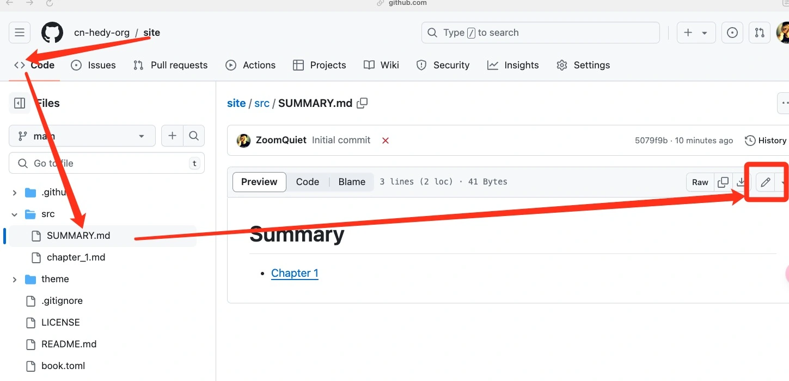
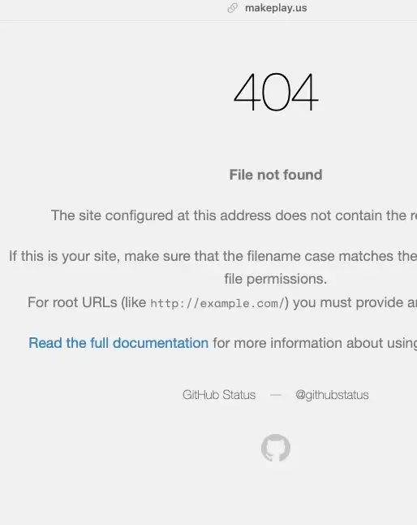

# 如何日常编辑网站?
> 在 github 网页端

## 目标

既然联合的是各种行业爱玩人士, 那么, 就不一定拥有 IT 建站技能;
所以, 需要:

- 零学习
- 最小注册依赖
- 公开场合工作

> 综上, 选择了 GitHb 平台

## 日常
> 日常进行各种编辑行为的简要说明

**注意:**

- 首先**要注册**为 github 用户
- 入口: https://github.com/
- 形成帐号类似:
    + https://github.com/ZoomQuiet
    + 注册成功,并登陆后, 在任一页面右上角点击自己的头像
    + 进入 `Your profile`
    + 此时, 网页地址, 就是你的 github 帐号
- 将此帐号邮件告诉管理员: [大妈]((player/dama.md))
    + `zquiet+ism@gmail.com`
    + 说明:
        + 你是谁
        + 从哪儿知道 `Makeplayism` 协会
        + 乐于分享什么内容
        + 以及关键的,你的 github 帐号
    + 管理员将进行**正式邀请后**, 才可以进行以下日常编辑操作

## 创建页面

从 Code 进入文件目录后, 点击编辑小图标:

首先在 [SUMMARY.md](https://github.com/cn-hedy-org/us/blob/main/src/SUMMARY.md) 中合理追加一个索引链接:

- 注意使用标准的 [Markdown 语法](https://docs.github.com/zh/get-started/writing-on-github/getting-started-with-writing-and-formatting-on-github/basic-writing-and-formatting-syntax)
- 指向正确的目录:
    - `./` 表示当前目录, 也就是说, 将创建和 [SUMMARY.md](https://github.com/cn-hedy-org/us/blob/main/src/SUMMARY.md) 在同一级目录中的文件
    - `player/dama.md` 则指向 `player` 目录中的 `dama.md` 文件
- 以及全部小写英文字母组成的文件名:
    - 可以包含数字
    - 统一文件后缀为 `.md`

然后, 在左侧导航中点击对应目录, 再点击 `+` 创建文件;

**注意:** 填写正确的文件名, 必须和  [SUMMARY.md](https://github.com/cn-hedy-org/us/blob/main/src/SUMMARY.md) 中指向的一致;

在新建文件中, 进行对应增补, 然后提交, 也就是点击`Commit changes` 按钮

这时, 从 `Actions` 菜单中就可以看到对应行为:

当最后的部署行为: `Deploy static content to Pages` 完成时,
也就是出现绿色对号后;

此时, 网站已经自动编译并更新部署到指定域名:

访问: [cn-hedy-org.github.io](https://cn-hedy-org.github.io/site/)

就可以看到最新内容了;

### PS:

如果访问时出现以下错误:

一般都是服务端在进行部署更新, 等候一会儿, 就可以了.

## 修改页面

登陆后, 直接进入文稿目录:

[/src at main · cn-hedy-org/site](https://github.com/cn-hedy-org/site/blob/main/src)

进入想编辑的文件, 进行编辑, 然后提交: 也就是点击`Commit changes` 按钮

等待 GitHub 完成自动流程就好;

## 使用图片
> 暂定流程, 注意节制使用

1. 将要使用的图片, 先转换为节省空间的 webp 格式:
    + 推荐使用类似这种在线服务:
    + [PNG轉WEBP轉換器。在线自由 — Convertio](https://convertio.co/zh/image-converter/)
1. 然后, 合理重新命名:
    + 全部小写英文字母组成
    + 可以包含数字
    + 文件后缀名也为小写字母:
        + 比如: `.PNG` 应该修改为 `.png`
1. 上传到 [site/src/images at main · cn-hedy-org/site](https://github.com/cn-hedy-org/site/tree/main/src/images), 这个固定的目录中
1. 在对应文件中使用相对路径来引用:
   + 如果, 想使用的文件是: [site/src/images/cnhedy-e-1_convert.io.webp](https://github.com/cn-hedy-org/site/raw/main/src/images/cnhedy-e-1_convert.io.webp)
   + 引用的文件是:
       + [src/README.md](https://github.com/cn-hedy-org/site/blob/main/src/README.md)
       + 则相对路径就是 `images/cnhedy-e-1_convert.io.webp`
       + 写成 Markdown 格式就是 ``
   + 引用的文件是:
       + [src/player/dama.md](https://github.com/cn-hedy-org/site/blob/main/src/player/dama.md)
       + 则相对路径就是 `../images/cnhedy-e-1_convert.io.webp`
       + 写成 Markdown 格式就是 ``
       + 其中 `../` 的意思就是回到上层目录,也就是说, 要从 `dama.md` 这个文件所在目录为起点,相对目标图片要走过什么样的路径来描述, 以便编译器知道从哪儿获得对应文件.

----

## logging

- 240715 DAMA init.
